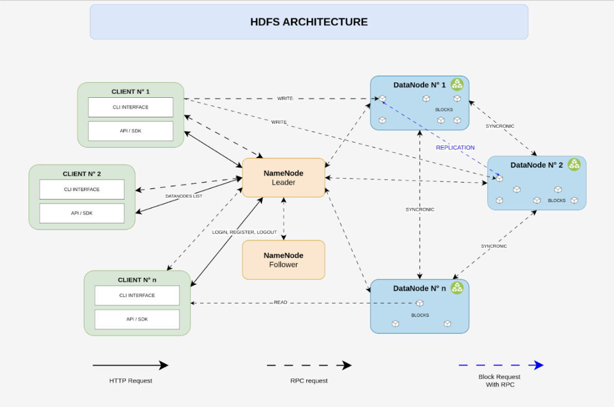

# Proyecto 1

**Curso:** ST0263 - Tópicos Especiales en Telemática
 **Profesor:** Edwin Montoya - emontoya@eafit.edu.co
 **Estudiantes:**
- Miguel Ángel Calvache Giraldo
- Mauricio David Correa Hernandez
- Miguel Angel Martinez Garcia
- Salomon Velez Perez
- Simon Botero
  
 **Título:** Proyecto 1 - Almacenamiento de datos distribuidos
 **Objetivo:** El objetivo del proyecto es diseñar e implementar un sistema de archivos distribuidos minimalista con diferentes servicios  **Sustentación:** 

## 1. Descripción de la actividad

 **Especificaciones finales del proyecto:** https://docs.google.com/document/d/1BWjEFo9onN4zYj9Sk8SyBW9M5ToxV9vimVzr1-dyPo8/edit#heading=h.h3ye4bivbzs

## 2. Arquitectura del sistema

A continuación se observa el diagrama de la arquitectura usada para nuestro proyecto.

